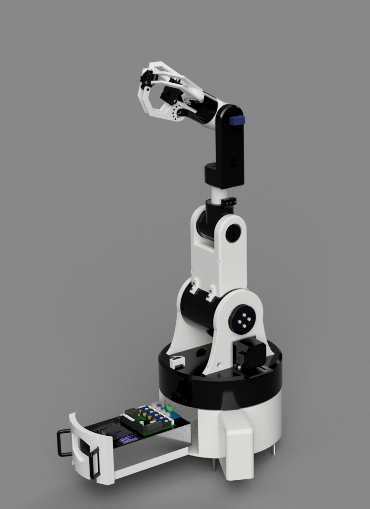
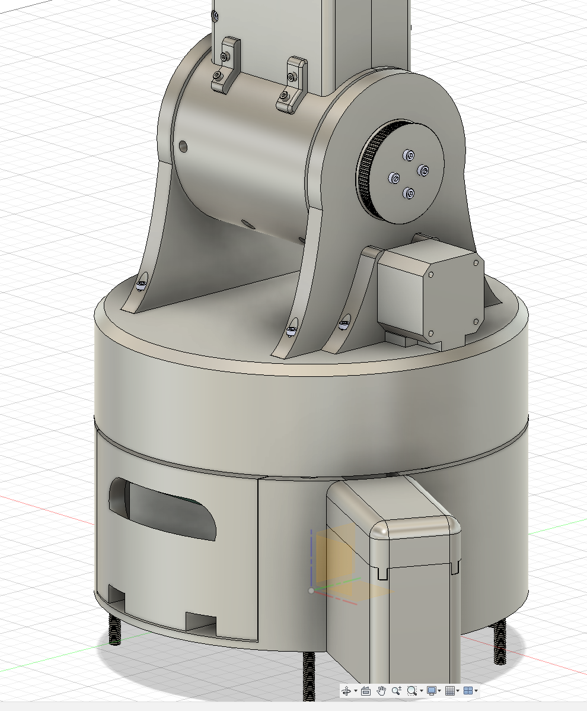

# Total Time Spent: ~86.75h

# May 22nd

## Start!

Got approval from alex yesterday and wrote down the BOM inso a csv today, also set up my repository with the journal and Readme and stuff, made a rough sketch for the first part(s) in class today :3 Design will definetly vary though, e.g ill add 6 screws and not 4 most likely

### Sketch:

**Session Time Spent: ~1h30mins**

## Basic structure design

Spent a bunch of time in fusion trying to figure out little details but ended up with a design for the component enclosure that im pretty happy with, attached below, making the screw holes next to the block (supposed to be the PSU) align with the edge of the psu so i can actually take it out was pretty painful, gonna have a hole there and thinking about maybe? adding rails to be able to kinda slide everything out for maintenance.

Also got info on what fuse i need for the psu iec socket (confusing but shoutout @Volkov08 for helping)

**Session Time Spent: 2h**

# May 23rd

## Getting first Electronics stuff down

So, today I wanted to review my stuff with steppers and so on and realized i might not have enough GPIO pins for all 6 stepper drivers + fan, lights,microphone, speaker, etc., after going on a journey looking up all the stuff i could do i decided to go for a PCF8575 i2c expansion module to control the steppers, turns out i2c is really cool for this. Found it and some basic components ill be needing on aliexpress, and pained myself with installing fritzing thrice with a bunch of problems for about an hour, got a pretty decent schematic down (not without going though a questionable amount of datasheets and manuals) though, attached below:

**Session Time Spent: 3.5h**

## Trying Kicad!

Decided to try and set up kicad to make a custom PCB for the project, fiddled around with it for a while, but i think it might be overkill for now so ill stick with the fritzing schematic, made more progress on the CAD design of the base (added the thrust bearing slot (kinda??) and made a slot for removing/inserting the PSU)

**Session Time Spent: 2h**

# May 24th

## Continuing CAD Design

I might be rushing the electronics a bit without knowing how much space exactly id have to work with, so i think this should be the approximate design of the base for now, pic 1 is fully assembled with the PSU and the pi (no idea what height so i guesstimated ~1.9cm) in silver and green and the thrust bearing in silver, second pic is the thing on which the bearing will be resting. Decided to make it seperate to the base to minimize supports and quick changes to the design if needed. Also make a holder for the Axis 1 stepper which will need some M3 screws and Bolts, gonna add them to my cart today 

Note: gonna update the BOM soon enough

**Session Time Spent: 2.5h**

## PCB!

Now that i had the rough amount of space down, i decided to make a pcb so that all the drivers and such arent just loose over the place. This was my first pcb design ever btw so pls dont judge the schematic quality T.T, for some reason i decided to make it in fusion and not in fritzing or kicad (no idea why, maybe bc i wanted the 3d model, i think kicad has that too tho), but i think it turned out decently, i did have a bunch of trouble with finding the sizings of the drivers and the i2c module as i was getting the tmc chip and not the whole module. After literal hours of research i turned to frizing (only place that had the footprint of the tmc2209 and i2c module) and found out theres a ruler function with which i got the thing in about 10mins😭, attached pics below of the pcb, shcematic and pcb inside the base

Also, this might get pretty warm so im thinking of adding a fan for cooling all that somewhere (sides/(front/back) of the psu?)

**Session Time Spent: 4h**

# May 25th

## Joints 1 & 2!

Made a bunch of cad progress today! First, I made a round shape thing for the 1st joint that would also hold the second joint in the middle: 

This turned out to be really impractical though because id need to magically insert a rod through the 2nd joint's arm part and then somehow also fit the servo next to it, so i decided to scrap that design and make a flat spinning base with a couple holders for the 2nd joint: 

for this ill need some gears, a rod and bearings (i already have the bearings at home), which added up to ~10-15$. I think its worth it tho since its 5 pcs of each so ill be able to reuse that for future joints. I also added some heat inserts for attaching the servos and future stuff with screws instead of glue, and some cable sleeving for the cables. I should really update my BOM soon

Speaking of cables, my next step might be making holes for the cables to pass through, i think itll be quite a challenge tho since i cant really fit a slip ring into the first joint, so ill have to account for spinning for the first 2 servos, I think ill try to add a slip ring at the next joint though.

Also, thinking about joint 3, I might remodel joint 2 to just use 2 bearings without a rod for that so i can fit a stepper directly in the center of it without the rod interfering (totally not copied from a guy i found online :3)

Design today:

**Session Time Spent: ~6h**

# June 3rd

## A bit of redesign and joint 3!

I havent posted in a couple of days, so ill summarize the progress as one session here. 

First of all, i changed the overall look of the "first" arm part, mainly so that joint 3 is a circle and can freely rotated instead of bein rectangular-ish and me having to put a stepper at the top. I also removed the need for a rod in the middle and made the whole thing be held in place by 2 bearings on each side. I then made a little hole and sliced the thing in two so i could add the 3rd stepper right inside of the arm. I think this should remove the need for screws there, but i might try adding slots for heat inserts somehow.

I also moved the whole gear thing to the outside of the 2 holders that hold the arm and made a decent holder for the stepper that ill also hold with some screws (should hopefully be able to hold, i gotta do that for the arm holders too). Speaking of the gear thing, ill most likely 3d print the bigger gear, which allows enough budget to maybe get a finer nozzle for better precision on that, since afaik 3d printed gears need some more precision to work decently (it should also save me some budget when i need more gears in the future), and with it being 3d printed ill be able to fit some heat inserts in there to attach it to the arm piece directly without a rod 

Some pictures:

I also made a rod with some slots for heat inserts for the 3rd joint which ill somehow attach to the next joint later on, plus i started making the heat insert radius use a variable so i wont have to change all of the holes if i ever change my mind on something

**Total time spent across sessions: ~10.5h?** 

## BOM update!!

Finally got to updating the BOM, i think that should be pretty much all for now, added some cables, heat inserts, flange couplings, etc. check ./BOM.csv or ./README.md for more details!

**Total session time spent: ~30mins**

## June 12th

### Redesign of joint 3 and 2

I realized that im kinda dumb and accidentially made joint 3 fully wrong (view photo below)

As you can see, the U axis is supposed to move the arm down, whereas i made it rotate the arm. I dont really want it that way so i redesigned the joint.

I put the stepper into the end of the joint, but doing a bunch of research (also considered high torque servos but meh, might look into them more though), the steppers im using right now will probably not serve close to enough torque, so i will probably redesign this to use gears.

Speaking of not enough torque, i decided to go with a stronger motor for joint 2 since it has to carry whe whole arm. I also upped the gear ratio from 3:1 to 5:1 and changed the mount. I found another stepper motor after designing this which isnt aliexpress choice so i gotta pay for shipping, it does however give me 40Ncm torque instead of 25Ncm on the choice stepper, so i might change this too.

Assuming i use the 25Ncm stepper, ill get 125N of force at joint 2, which gives me about 4N torque @ 30cm and 2N @ 60cm.
With the 40Ncm stepper ill get 6N @ 30cm and 3N @ 60cm.

I should look into nema23 steppers.

Also, after looking at my torque amounts, i might cut the max range of the arm to 60cm instead of 1m.

Current Joint 2 mount: 

**Total time spent: ~ 5h**

## June 13th

### Work on Joint 3!

So, i did a bunch of research on aliexpress and watched a ton of youtubers making hobbyist arms, and decided to keep a stronger motor for joint 2 only, since thats carrying the whole weight of the arm. I didnt want to use multiple since i got some limited amount of space in the base of the arm and my current small drivers cant handle the current needed for stronger motors.

Inspired by Steward Technologies on youtube, i decided to use the ton of space i had inside the arm to make a gear setup for joint 3.

This turns the 13Ncm torque from the small stepper into 208Ncm with a total gear ratio of 16:1. I still have to redesign the joint itself at the top to have a gear in the middle with 2 holders on the outside (opposite of the current setup)

I also found out from another youtuber that im absolutely stupid and my custom pcb is totally useless since i can get RAMPS 1.4 board for a fraction of the price on aliexpress. Its got everything except i2c, but i dont mind a bit of cabling between the board and the i2c module.

**Session time spent: ~3.5h** (didnt track on this session, guesstimated)

## July 3rd

Had some time to work on the project in the last weeks, didnt write journal logs though since i was adding 1 mini feature per session but that kinda built up over some time.

Current build:

So, i started and kinda made joint 4 after quite a couple redesigns, the gear being in the middle was pretty annoying since id have to kinda print it in multiple parts and the cylinder of the arm would probably be weirdly attached to the whole structure. In the end i decided to move it to the side, but in exchange i had to make the last gear a bit long (actually writing this i realize i could be 2/3 as long idk why i did all that).

I also designed the cover of joint 3 to be attachable with a couple screws (4 screws to assemble it, 8 to attach to the big cylinder (on which i still gotta see how i wanna assemble it))

Also dug around quite a bit in search of better steppers, couldnt find anything better than what i currently have though.

Plans for the last 2 joints (the "hand part") are to probably use some lightweight steppers since it doesnt need that much torque to hold stuff and using steppers would make it real hard on joints 2 and 3. Also, depending on the steppers ill probably be able to get away with a 15A PSU which would actually fit inside the housing for the arm as planned.

I additionally gotta get inspired by something to get a decent gripper down and find a place to install the microphone and speaker.

**Total Time Spent over Sessions: around 12h**

## July 11th

Made progress on joint 5 and started working on the gripper, thinking of how to make the hand part modular (will be one of the last things after the gripper)

### Joint 5

Thought a design like this would look the best overall, the only downside of it being the possibility of the joint breaking off. I still need to see how id fix that :/, Joint 4 is fully finished though, with an added bearing for stability of the rod.

To rotate Joint 5 I decided on a MG90S servo, its got metal gears, a 270deg range and pretty decent torque. I will also be using one for joint 6, but for the gripper ill use a continuous rotation servo i got laying around.

Speaking of the gripper:

this is the coolest mechanism i found (also basically the only one with 3 fingers which could also possibly fit the camera in the middle), however, the cad files for it arent available so i had to make a couple prototypes to get to this design:

its just an outline of the gripper to see how the mechanism would perform when printed, which wasnt with much success sadly. Main problems are the gears changing a bit due to their size and my .4mm nozzle (even after i changed the outer gears to this "inverted" type), which shouldnt be a problem with a .2 nozzle though, and the outer gears not touching the middle worm gear. To fix that though, i plan on adding a couple springs and make the gear holders rotateable, so the gears are always pushed against the middle gear. Printing the worm gear is also pretty hard, ill look into buying one.

**Session time spent: ~4h**

## July 16th

### Finishing the gripper

Over the past couple days i tried around more with printing gears, etc. with bigger module gears i finally got to this design:

with bigger gears with holes for bearings, a camera mount and fingers with moving fingertips this should be pretty close to my final claw design. This took a couple days of progress but im pretty happy with the final design, only thing i do need to fix are the  "legs" for the camera holder, one of them is right above the servo and should probably be either shorter or positioned somewhere else, ill figure that out tomorrow.

**Total time spent: ~5h**

## July 17th

### Final touches on the gripper and audio modules

Added little "ears" for the camera stand legs since the distance between them and the fingers was like .2mm and i did not wanna risk the legs getting pushed out each time i open the hand.

Also, you can see i replaced the "pins" holding the gripper part together with M2.5 screwholes, for convenience when disassembling/assembling. Overall, this should be it for the gripper! once again, pretty happy with it, only problem is the modularity of the gripper part, its not as easy as i wanted to switch it out (gotta disassemble the whole gripper to get to the servo), might wanna see if i can redesign it sometime to be fully modular with less hassle.

PS: didnt realize i forgot to document the "pins": i made  the bottom part of the grippers cylinder seperate from the upper part to allow inserting a servo for opening/closing the gripper. I connected the 2 parts with little pins/pills and was planning on just gluing them together

Also made slots for the speaker and microphone:

and for the amplifier: 

Additionally, i added some scew holes to connect the "forearm" part to the 4th joints cylinder since i probably couldnt print the 2 parts in one part (even if i could, that would probably be too weak to hold the whole gripper, etc.)

**Total time spent: ~1.5h**

## July 20th

### Mounting the gripper

After pondering for a loong while i finally came to this: 

My main problem here was the relatively small space for the 2 motors that needed to be around that general area.

In the end, i put the gripper servo inside the wrist and the wrist servo outside, but then i encountered another problem: to attach the wrist to the servo i needed a full cylinder of space for the screwdriver right infront of it, which would be blocked by the gripper servo. I then realized that i can just install the gripper after the wrist servo, so i didnt need that space there the entire time. The same cylinder can then be also used as a guide outside for the gripper servos cables (theyre at the right side of the wrist, furthest from the opening) 

I also didnt realize for a while that i can insert the wrist servo from the wrists side like so: 

and mounting it from the other side resulted in not enough space for the screw to hold the servo in place, so i was stuck on that for a while aswell.

Overall, my only concern here is that the wrist might potentially not hold well enough on  the servo alone, but even if it bends the bit smaller clearance between the two parts should kinda hold it and the fact that its a metal gear servo should also add some strength.

I also designed the inner part of the gripper to house one servo and be attachable to another servo:

**Total time spent ~3.5h**

## July 21st

### Stepper driver and electronics hatch

Since im using a stronger stepper for the second joint, i cant use a TMC2209 driver as that can only handle up to 2 amps of current. My initial plan was to somehow fit this stronger driver inside the base, but sadly the ring holding the thrust bearing kinda obstructs accessibility to it and theres no way of adding that without needing supports, which im trying to avoid. Best option i could think of was mounting it outside the base, in a way i could easily access the wires if needed. 

Also changed the driver to a TB6600 since the previous one cost a bit more and was a bit bigger, and i wanted to use minimal space here.

Final design:

Most of the holder part is printed seperately, and secured to the base with 8 cylinders. Also has a little cover that slides into place since i do not wanna have the wires exposed

Without the cover: 

Second, I wanted to make the PSU and all other electronics be able to slide out of the base for simpler maintenance, etc. I dont have much space anywhere around the PSU, and i thought i needed at least 2cm space behind the rails to mount them with screws, so i first tried expanding the room for the PSU and such by about 1cm to the left and right, but thats about as much as i could go, and sadly the rail needs 1cm space plus some more to actually hold something.

For reference:

I also believed mounting it at the bottom of the base would be impossible as ive only got about a centimeter of space extra, but upon closer inspection i found a bunch of holes on the backside of the rail:

with this, i could probably add some cylinders which should hopefull have enough strength together to hold the whole thing.

Actually, now that i think about it further im pretty sure the rail could just fall out when fully opened as the cylinders dont really hold it down. Ill need M4 screws to attach the platform on which the psu lays either way so im gonna add some 5mm M4 screws and m4 bolts and try to secure the rail with a couple of those.

Sadly though, there arent any measurements of the holes on the page, so i cant really add much until i measure the parts myself.

My current design looks something like this:

Some slots for the rails, a little block at the end to prevent the psu from just sliding off when opening it too fast, and i got some extra space at the front for some m4 screws (distance between the top surface and the rail is about 5mm, should be fine if i add some indents)

For the handle, i first wanted to make it printable seperately, but i like this design so i think ill stick with that for now.

**Total Time spent: ~5h**

## July 22nd

### A bit of polishing and review

Went over the whole design today, and checked out if i missed tolerances, etc.

main changes are the addition of screws to hold the main cylinder together and an improved holder at joint 3 that prevents the 7mm bearing from moving inside the 1.5cm wall.

The cylinder has 3 M3 screwholes on each side, 6 total. Also saw that the 3rd joint wasnt aligned properly and that i was missing tolerances on almost all the bearings (including those that hold the rods for the 3rd joint gears)

Also expanded the holes here for better fitting of the screws, which would interfere with the big cylinder otherwise.

Reviewed the electronics aswell, as i was thinking of installing limit switches for homing/calibration and found out that the RAMPS board isnt really meant to be used with something else than an arduino mega, so i decided to discard that. Only alternative i found was using a 3d printer control board, which i found for about 14$ on aliexpress (had to move some of the items ill order to bundle deals since it was only available there).

Board is the Fly-D5 board and can run klipper (gotta look into the usage of that aswell), should be more than enough for driving 3 of my steppers.

For the servos, ill use a PCA9685 servo driver that ill be able to control with i2c. im unsure whether i can rely on the orange pis pwm for the servos, and having a driver makes it easier to also use a 12 to 5v converter, seperate from the one powering the pi.

I also decided to use a TCA9548A i2c expansion board for the adc(to read the grippers pressure sensors), servo driver and audio system.

**Total time spent: ~3.5h**

## July 24th

### Wiring!

Did some more research on electronics overall and fully made the wiring plan in fritzing! (Note: some stuff might be missing since i cant add them to fritzing/the model doesnt exist for fritzing)

This should be about everything for the electronics, excluding the other stepper control board, which ill connect via usb (and also couldnt find as a fritzing model)

While wiring, i also found out the Orange pi Zero 3 doesnt have i2s/i2s is hard to setup and there arent any microphones or speakers using something else, so i decided to discard the audio system (saves some budget aswell) and just use bluetooth headphones i already have for audio input/output.

The Stepper driver in the photo isnt the one im using since i also couldnt find the TB6600 for fritzing, but its similar enough and should do for the diagram.

For the pressure sensors, i used a breadboard here, but ill use a prototype board when building, as i dont think breadboard connections would hold that well (ill also add cables for them of course, i decided on shielded ones since i dont want noise from the steppers, etc. disrupting the measurements (adds like 2$))

**Time spent: ~2.5h**

### Screws!

Read in #highway-pitstop that submissions need files of all the electronics, presumed that that included screws, etc. so i added most of the stuff i need (still missing some stuff), mainly screws.

Tried to use the built in insert fastener feature which didnt work and made me fiddle around with fusion for about an hour and a half at least (not gonna add that to the time here), ended up just importing the files seperately and copy/pasting them to their locations. At the part where the main cylinder attaches to the joint 3 gearbox cover, i couldnt get 4 of the screws perfectly aligned, but since its mainly for show, i think it should be fine.

Also went though all the bodies and seperated all the ones that were sketches/unused into a trash folder, for better overview of the project.

Thats about all for today, gonna import the steppers tomorrow hopefully and add some more stuff!

**Time spent: ~1h**

## July 26th

### Final additions (probably not final)

Went over some stuff again and realized that steppers have screws on the backside to hold them together and on the front side to be attached, researched about the estimated screw length for attachment but couldnt find anything, went with about 6mm. I cant use 35mm screws for the 48mm stepper since there probably wont be enough space and the screw wont go competely through it (thereby not also doing the function of the back screw and holding it together), but i presume i can for the smaller steppers that are about 23mm in size.

Ended up adding a bracket for the bigger stepper and made openings in the base cover for wires, also removed 2 of the support "lines" for the 1st stepper holder, but made the other two thicker, so i had the approximate same strength but a bigger area for wires to move in (with 4 lines holding the stepper in the middle the arm coulve rotated about 90 degrees before sketchy wire stuff happening, with 2 its 180deg).

**Time spent: ~2h**

## July 27th

### Preparations for shipping!

So, today i wanted to kinda finalize my project so i could optimally ship it tomorrow (after i get an outline on the software done hopefully).

I Added all motors and servos, bearings, and found a dummy model for the camera. I also decided to color in the project (turns out im shit at colouring, but eventually managed to get somewhere) as id probably not print it all in one color anyway and uncoloured looked overall bland and not really shippable. I also rendered it a couple times, rly love my result so far!

(beautiful render)

I Also added holes everywhere they needed to be for wires of the motors, and inserted all electronics i could (not adding the pressure sensors etc. bc theyre pretty hard to add imo)

Pic below shows the wire holes at the backside of the arm and the electronics (just the fly d5 and the orange pi here, i could maybe add the bigger stepper driver? but more than that would probably be overkill)

One big thing youll also notice is that i changed the PSU sliding holders appearance, as i heavily underestimated the size of the outlet, and had to get rid of the super cool inset handle i had :/

I started work on a insertable handle (maybe one handle on both sides so i can kinda slide it out with both hands and that would possibly look cool), but i think ill finish it tomorrow.

Bearings inserted into the model at joints 2 and 3:

i also fixed some small errors like the joint 3 hole not being big enough for the inner ring of the bearings and the gripper not being aligned with joint 3s rotation, which would probably make the whole thing a bit harder to control overall.

(Plus i named all the bodies so theres some sort of sense of order when opening the model)

**Time spent: ~5h**

### New Grips!

Designed new handles, they should just slide in from the top and after that not slide out (i could just glue them), overall decently happy enough with the looks of it.

**Time spent: ~15mins**

## July 29th

### Model shippable!!!

Finally! Spent a bunch of time on making joints for EVERYTHING (every bolt and tiny detail is jointed), even added gear ratios so i can see how the gears would spin irl! This all allows me to pose the arm however i like (probably would be needed for shipping, gives me the ability to make cool poses for rendering and overall opportunity to go over the whole design again and review some stuff/find errorrs (which i actually did while doing this)). All joints now rotate like they would irl and the drawer and TB6600 stepper driver cover slide out!

Reviewed what i needed for shipping overall, and added most of the electronics (didnt add some smaller ones that arent as relevant, for example the protoboard im gonna put my pressure sensors circuit on). 

The submission requirements include all electronics, so added the FLY D5 board, orange pi, servo driver and ADC. Also added smaller bearings for joint 3 and limit switches!

limit switches: as the TB6600 doesnt have sensorless homing sadly, i needed a limit switch for joint 2 which i added a simple holder for. Also realized i couldnt home joint 4, so i added a little pin that would hit another limit switch installed right next to the shaft.

(Pin currently not touching switch, as i chose a different model with a rolling ball on the tip that increases its range and lets the joint move in both directions)

**Total time spent: ~5.5h**