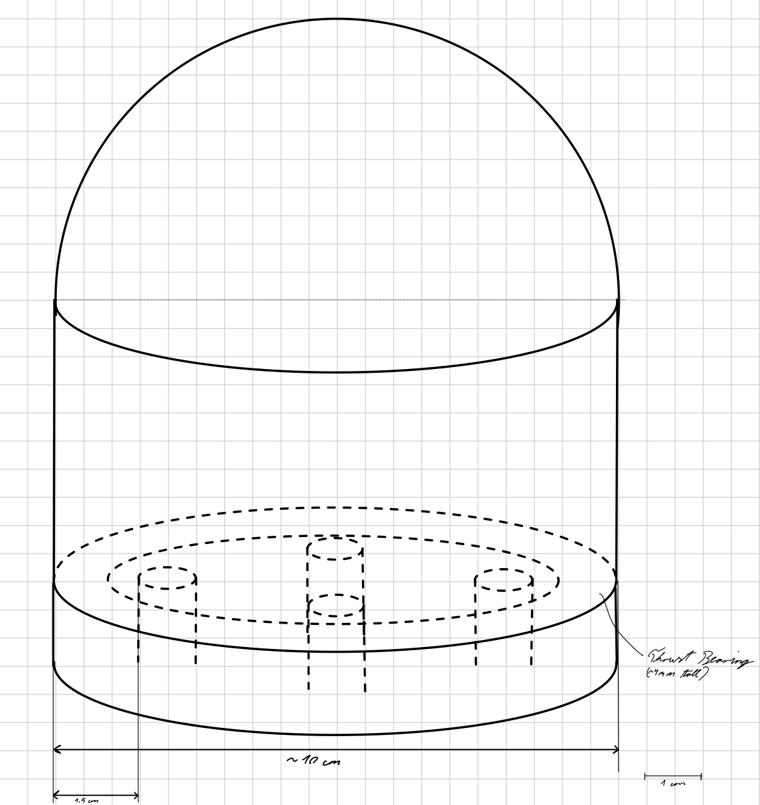

# Total Time Spent: ~1h30mins

# May 22nd: Start!

Got approval from alex yesterday and wrote down the BOM inso a csv today, also set up my repository with the journal and Readme and stuff, made a rough sketch for the first part(s) in class today :3 Design will definetly vary though, e.g ill add 6 screws and not 4 most likely

### Sketch:

**Session Time Spent: ~1h30mins**